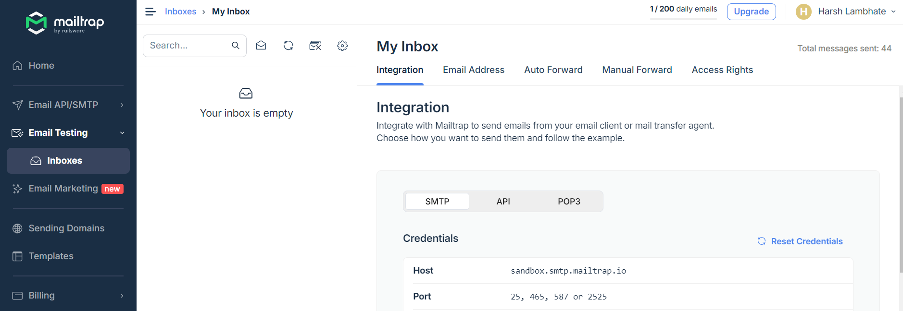

# nodmailer_app


```bash
  npm run start
  npm install bull --save
```
##  Mailtrap


##  MongoDB


##  Redis
https://github.com/tporadowski/redis/releases

Provide redis path into system environment variable
```
 redis-server
 redis-cli
    >127.0.0.1:6379>PING
    >PONG
```